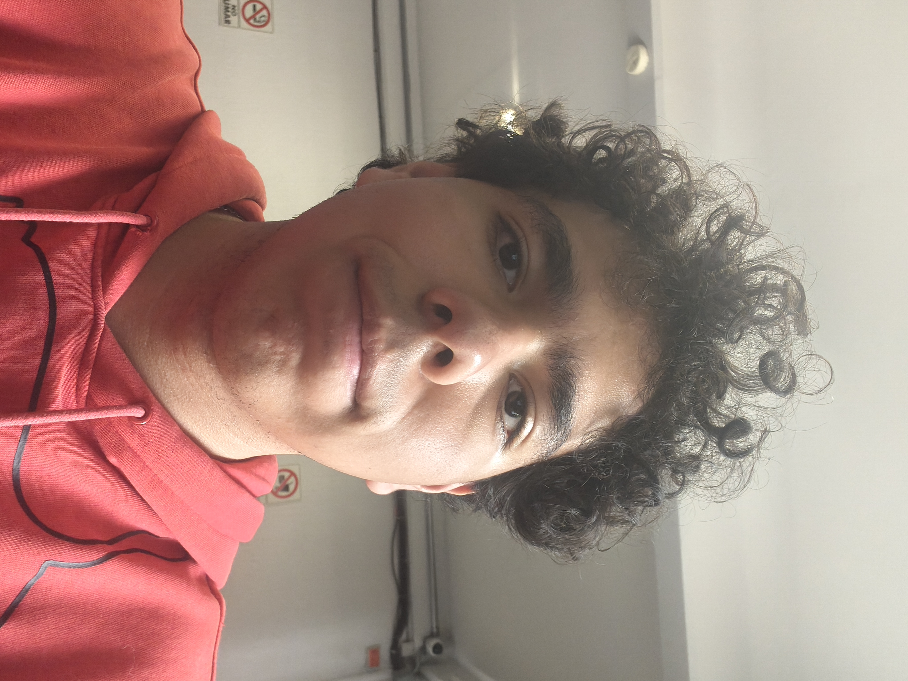

# Rogelio Angel Hugo Sanchez Camacho

¿Por qué elegiste la carrera que estudias? y en ¿qué esperas trabajar profesionalmente?

Esta carrera la elegi porque me interesa desarrollar un juego propio y tener las habilidades para poder desarrollarlo.

Espero trabajar profesionalmente en el juego que quiero desarrollar por cuenta propia y aparte de tener la satisfaccion de realizar un juego de manera profesional poder ganar monetariamente al ir subiendo juegos a plataformas como play store o steam o trabajar en una empresa famosa.

### Pasatiempos favoritos

1. Dibujar en tiempos libres
1. Entrenar boxeo ciertos dias
1. Ver una pelicula con mi familia
1. Jugar videojuegos con mis amigos
1. Hacer alguna receta de cocina

### Enlaces de Contactos

- [Instagram](https://www.instagram.com/r_o_g_e_rz?igsh=MW16eTJmZHNxa2U3MA==)

- [Tiktok](https://www.tiktok.com/@rogerzg?_t=ZS-8zHtqR4CwHC&_r=1)

### Imagen

- 

## Entregables

- [Practica 1](mds/apuntes.md)

- [Practica 2](mds/ramas-fusiones.md)

