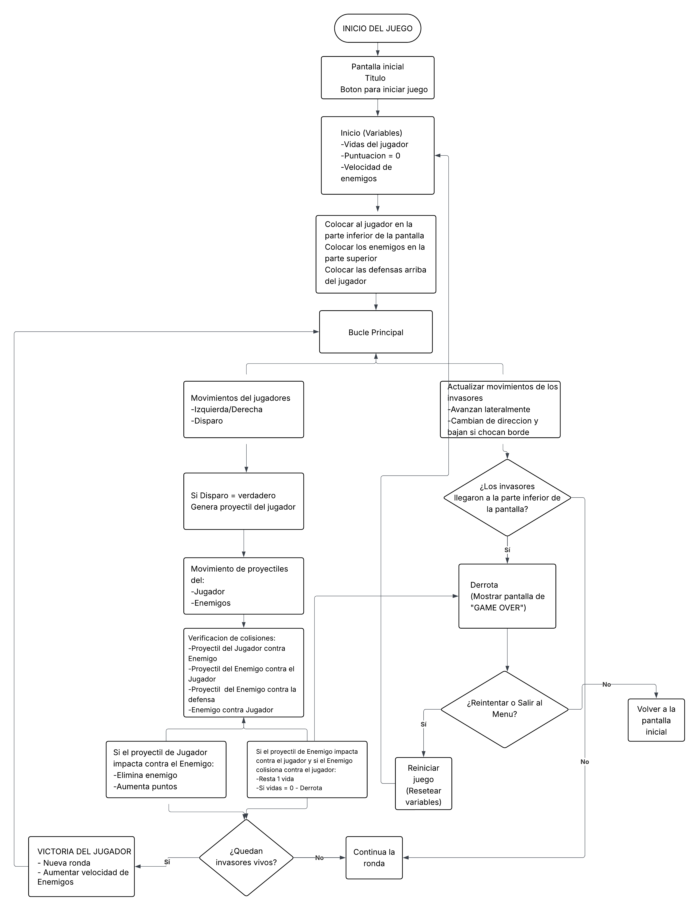

# **Space Invaders**

## Historia del videojuego

En la historia de los videojuegos, muchos han dejado huella y uno de estos es Space Invaders, lanzado en 1978 por el diseñador japonés **Tomohiro Nishikado** y distribuido por Taito, haciendo de este juego arcade un título que revolucionó la industria de los videojuegos, creando las bases para muchos juegos interactivos del presente.

Space Invaders surgió durante la época dorada de los juegos arcade, dando a conocer un concepto novedoso. El juego trata de defender la Tierra de las oleadas de invasores alienígenas** con una nave cuya jugabilidad es sencilla, pero a la vez desafiante.

El juego arcade trascendió el mundo de los videojuegos y se convirtió en un fenómeno cultural. Su popularidad fue tanta que inspiró productos, adaptaciones en diversos medios e incluso influyó en las tendencias de moda. Space Invaders se convirtió en una experiencia arcade inigualable e innovadora, dejando una huella imborrable en la historia de los videojuegos con sus características icónicas: alienígenas pixelados y naves espaciales.

Siendo uno de los primeros juegos de disparo, Space Invaders revolucionó la tecnología de la época y, gracias a su éxito, abrió el camino para avances en gráficos, audio, efectos, mecánicas y nuevos conceptos que definirían títulos posteriores.

---

## Reglas y mecánicas del juego

### Reglas del juego
- El jugador solo puede mover su nave horizontalmente (izquierda/derecha).  
- El jugador solo puede disparar hacia arriba.  
- Los enemigos descienden en bloque hacia la parte inferior de la pantalla.  
- Si los enemigos llegan al borde inferior, el jugador pierde automáticamente.  
- El jugador tiene 3 vidas.  
- Si la nave del jugador es destruida por un proyectil enemigo, pierde una vida.  
- El juego termina cuando se acaban las vidas (Game Over).  
- Si elimina a todos los Enemigos, se detecta como Victoria y pasa a la siguiente ronda.  

### Mecánicas del juego
- **Movimiento del jugador**: teclado o joystick para moverse de izquierda a derecha.  
- **Disparo**: el jugador solo lanza un proyectil a la vez hacia arriba.  
- **Enemigos en bloque**: se mueven en conjunto, avanzan hacia los lados y descienden al llegar al borde.  
- **Dificultad**: cuando quedan menos enemigos, su velocidad aumenta.  
- **Puntuación**:  
  - Cada invasor destruido otorga puntos.  
  - Los platillos voladores (UFO) que aparecen en la parte superior otorgan puntos extra.  
- **Barrera**: en algunas versiones hay barreras destructibles que protegen al jugador temporalmente.  
- **Rondas**: cada nivel terminado reinicia con nuevos Enemigos más rápidos.  

---

## Algoritmo del juego

1. **Inicia juego**:

- Cargar pantalla inicial.  
- Definir vidas del jugador, puntaje en 0 y nivel 1.  
- Generar formación inicial de Enemigos.  

2. **Mientras el jugador tenga vidas y no haya terminado el juego**:

- Controles para moverse de izquierda a derecha y disparar.  
- Mover Enemigos en bloque (izquierda/derecha y descender al llegar al borde).  
- Actualizar proyectiles enemigos si existen.  

3. **Colisiones**:

- Disparo del jugador contra Enemigo → eliminar Enemigo + sumar puntos.  
- Disparo del enemigo contra jugador → restar vida.  
- Si los Enemigos llegan al límite inferior → Derrota inmediata.  

4. **Condiciones de derrota**:

- Vidas = 0 → Game Over.  
- Invasores llegan al límite inferior → Game Over.  

5. **Condición de victoria**:

- Eliminar a todos los Enemigos → superar la ronda.  
- Superar todas las rondas → ganar el juego.  

6. **Aumento de dificultad**:

- Incrementa el nivel por ronda superada +1.  
- Aumenta la velocidad de los Enemigos.  
- Aumenta la frecuencia de disparos Enemigos.  
- Reinicia la formación de enemigos y continua con el bucle.  

7. **Final**:

- Se repite el bucle hasta victoria final o derrota.  
- Se muestra la pantalla de **Fin del juego** con el puntaje final.  

--- 

## Diagrama de Flujo de Space Invaders

- 

---

## Prompt para IA

En lenguaje html construye un juego de Space Invaders que tenga opciones para reiniciar o irse al menu principal cuando pierde el jugador, que de niveles maximo tenga 3 donde por cada nivel superado aumenta su dificultad y donde el jugador inicie con 3 vidas colocando los enemigos y al jugador en sus respectivos lugares como en el juego original puedes ayudarte con este algoritmo y diagrama de flujo trata de que sea semejante al original:

- Algoritmo del juego (Contiene el mismo texto de este archivo)

- Diagrama de flujo (Imagen del diagrama de flujo que se presenta en este archivo)

## Enlace de la conversacion

- [IA utilizada: ChatGPT]() 

