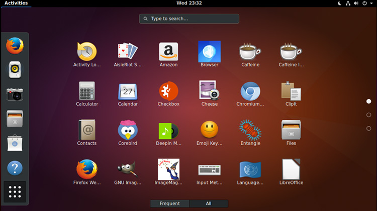

# Asignaturas 3DEVs

## Sistemas_Operativos_y_redes
### Profesor: Alcides Albora Garcia

En esta materia estoy aprendiendo todo sobre los compenentes y sistemas que tiene una computadora junto con un sistema virtual y como moverse atraves de comandos.

