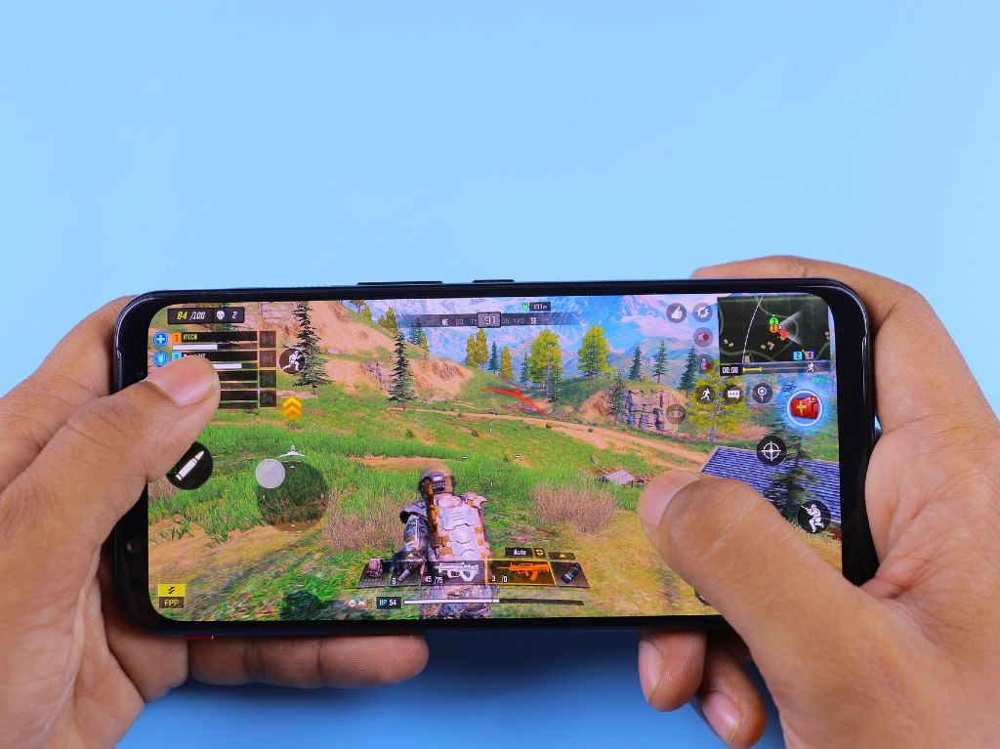

# Asignaturas 3DEVs

## Proyecto_Semestral
### Profesor: Guerrero Troncoso Eduardo Ignacio

En esta materia estoy aprendiendo a como documentar el juego que haremos para telefonos centralizando las ideas.

## Diseño_de_Videojuegos
### Profesor: Ana Guadalupe Olivar Araujo

En esta materia estoy aprendiendo a como utilizar Unreal Engine y como desarrolar el concepto del juego de manera mas organizada.

## Principio_de_Composición_y_Diseño
### Profesor: Roberto Melo Ortiz D Ora

En esta materia estoy aprendiendo a utilizar Photoshop para hacer foto montajes, jugar con los ajustes de la imagen y conceptos del diseño.

## Programacion_En_Lenguajes_Interpretados
### Profesor: Jonathan Ulises Miranda Charles

En esta materia estoy aprendiendo a utilzar visual studio code con el lenguaje de git bash y utilizarlo para crear archivos, carpetas, moverse atravez de Visual, crear ramas, guardar y como utilizar o crear los repositorios de GitHub.

## Sistemas_Operativos_y_redes
### Profesor: Alcides Albora Garcia

En esta materia estoy aprendiendo todo sobre los compenentes y sistemas que tiene una computadora junto con un sistema virtual y como moverse atraves de comandos.

## Ingles_Tecnico_Para_Videojuegos
### Profesor: Oropeza C1

En esta materia estoy aprendiendo a como vender un producto o juego, como funcionan sus slogans y los conceptos gramaticales que se necesitan o utilizan. 

